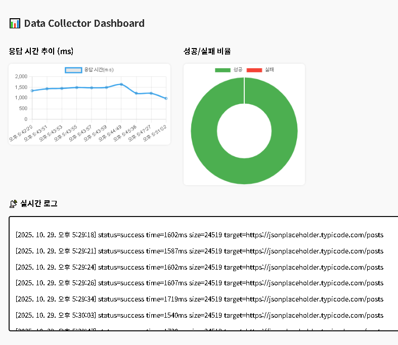

# Step 3-1 – 실시간 로그 스트림 (SSE)

## 목표

- 서버에서 수집 로그 파일(`collector.log`)의 변경을 실시간으로 감지
- **Server-Sent Events (SSE)** 를 통해 클라이언트에 실시간 데이터 전송
- **프론트엔드 대시보드**(`dashboard.html`)에서 로그를 실시간으로 표시

---

## 프로젝트 개요

- **Express** 기반 서버에 `/stream` 엔드포인트 추가
- `fs.watch` 로 로그 파일 변경 감지
- 브라우저와 **SSE(Server-Sent Events)** 로 실시간 통신
- `/public/dashboard.html` 에서 `EventSource` 로 로그 표시

---

## 테스트

```bash
1. Tor 브라우저 실행 및 접속
2. npm start
3. 브라우저 실행 http://localhost:8080/dashboard.html
4. 새 탭 실행 http://localhost:8080/collect
5. /collect 새로고침할 때마다 dashboard.html 화면 자동 반영
```

### 출력 예시

브라우저

```bash
http://localhost:8080/dashboard.html
실시간 수집 로그
[2025-10-24T10:00:00.000Z] status=success time=4123ms size=53100 target=https://jsonplaceholder.typicode.com/posts
```

터미널

```bash
Server running on port 8080
SSE 연결 완료
```

## 학습내용

- SSE(Server-Sent Events) 서버가 브라우저로 실시간 데이터 푸시
- fs.watch
  파일 변경 감지
- Express static
  /public 폴더를 정적 파일로 제공
- 이벤트 기반 비동기 흐름
  서버 → 클라이언트 단방향 실시간 스트림 처리

# Step 3-2 – 실시간 수집 대시보드 (SSE + Chart.js)

## 목표

- 수집 로그(`collector.log`)를 실시간으로 브라우저에 표시
- **Server-Sent Events (SSE)** 를 이용한 서버→클라이언트 단방향 실시간 통신
- **Chart.js** 를 활용한 시각화 대시보드 구현
- 응답시간 변화 추이 & 성공/실패 비율 그래프 표시

---

## 프로젝트 개요

| 구성요소                | 역할                                                      |
| ----------------------- | --------------------------------------------------------- |
| `server.js`             | Express 서버 + `/stream` 엔드포인트(SSE) + `/collect` API |
| `collector.js`          | 실제 데이터 수집 및 로그 기록 (Step2 코드 재사용)         |
| `public/dashboard.html` | 실시간 로그 및 차트 시각화 UI                             |
| `logs/collector.log`    | 수집 결과 로그 저장 파일                                  |

## 출력 예시



## 학습내용

- SSE(Server-Sent Events) | 서버 → 브라우저 단방향 실시간 스트림
- fs.watch | 파일 변경 감지 이벤트 기반 업데이트
- Chart.js | 브라우저용 시각화 라이브러리
- 실시간 데이터 파싱 | 로그 문자열을 정규식으로 분석하여 차트 업데이트
- UI 자동 스크롤 | 최신 로그가 항상 화면에 보이도록 처리

📘 이 프로젝트는 개인 학습 및 포트폴리오 용도로 제작되었습니다.
